# 🐍 Python Basics You Need Before Building a Chatbot

This guide covers every Python concept used across all 4 chatbot guides: Basic Chatbot, Memory, Tools, and Agent. Nothing random here. Every example is something you'll literally see in that code. Finish this once and all 4 guides will read like plain English instead of confusing syntax.

---

## Table of Contents

1. [Why this guide exists](#why-this-guide-exists)
2. [Variables and f-strings](#1-variables-and-f-strings)
3. [Digging into nested data](#2-digging-into-nested-data)
4. [Functions and type hints](#3-functions-and-type-hints)
5. [Dictionaries](#4-dictionaries)
6. [Nested dictionaries and lists](#5-nested-dictionaries-and-lists)
7. [Lists](#6-lists)
8. [Lists of dictionaries](#7-lists-of-dictionaries)
9. [Dictionaries as lookup tables](#8-dictionaries-as-lookup-tables)
10. [Unpacking a dictionary into a function call](#9-unpacking-a-dictionary-into-a-function-call)
11. [if / else](#10-if--else)
12. [while True loops](#11-while-true-loops)
13. [A loop inside a loop](#12-a-loop-inside-a-loop)
14. [Imports](#13-imports)
15. [Chaining function calls](#14-chaining-function-calls)
16. [eval(), running text as code](#15-eval-running-text-as-code)
17. [JSON strings vs Python dictionaries](#16-json-strings-vs-python-dictionaries)
18. [Putting all of it together](#17-putting-all-of-it-together)
19. [Word List](#word-list)
20. [What's Next?](#whats-next)

---

## Why this guide exists

Look at this one line from the Tools guide:

```python
tool_result = tool_map[tool_name](**tool_args)
```

If you don't know what a function is, what a dictionary lookup is, or what `**` does, this looks like magic. It's really just 3 basic ideas stacked together. This guide breaks every idea apart on its own first, so lines like this read like plain English by the time you get there.

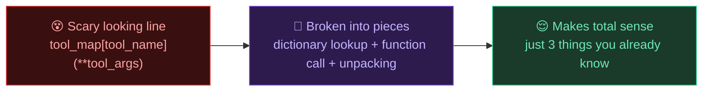

---

## 1. Variables and f-strings

A variable is a labeled box that holds something.

```python
user_input = "What is Python?"
```

f-strings let you drop a variable's value directly inside a sentence, instead of stitching strings together with `+`.

```python
city = "Islamabad"
print(f"Weather in {city}: 34°C")
# Output: Weather in Islamabad: 34°C
```

You'll see this exact pattern in the weather tool later:

```python
return f"Weather in {city}: {weather['current_weather']['temperature']}°C"
```

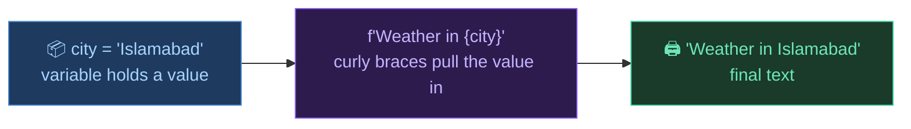

Just remember, anything inside `{ }` in an f-string is real Python, not plain text. `{city}` prints whatever is stored in `city`, not the word "city".

---

## 2. Digging into nested data

A lot of chatbot code is just "go inside this, then go inside that." You'll see chains like this constantly:

```python
response.choices[0].message.content
```

Read it left to right, one step at a time:

| Step | What you're doing |
|------|-------------------|
| `response` | the full object you got back |
| `.choices` | go inside it, grab the list called `choices` |
| `[0]` | take the first item in that list |
| `.message` | go inside that item, grab `message` |
| `.content` | go inside that, grab the actual text |

Same idea with dictionary style nested data, just with `[ ]` instead of `.`:

```python
weather['current_weather']['temperature']
```

| Step | What you're doing |
|------|-------------------|
| `weather` | the full dictionary you got back |
| `['current_weather']` | go inside it, grab the value stored under that key |
| `['temperature']` | that value is itself a dictionary, go inside it and grab `temperature` |

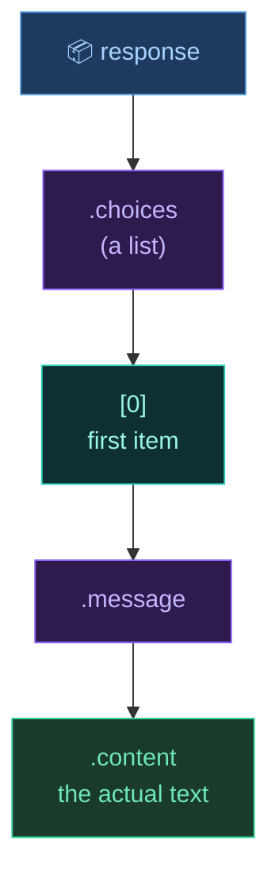

So `.something` means go inside an object and grab this piece. `['something']` means go inside a dictionary and grab the value at this key. `[0]` means grab the first item of a list. A long chain is just several of these steps back to back, nothing more advanced is happening there.

---

## 3. Functions and type hints

A function is a reusable block of code you run by calling its name.

```python
def calculator(expression: str) -> str:
    return str(eval(expression))
```

| Part | Meaning |
|------|--------|
| `def` | "I am defining a new function" |
| `calculator` | the name you'll use to call it later |
| `(expression: str)` | the input the function expects, and `: str` is a type hint saying this input should be text |
| `-> str` | another type hint saying this function will return text |
| `return` | the value the function sends back after running |

```python
answer = calculator("1847 * 293")
print(answer)   # 541171
```

One thing worth knowing, type hints like `: str` and `-> str` are just notes for humans reading the code. Python doesn't actually enforce them. They don't change how the function runs, they just make it obvious what goes in and what comes out.

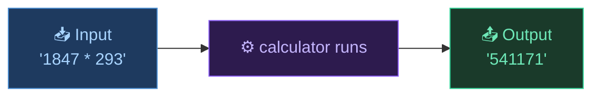

This matters a lot because tools are just functions. When the AI "calls a tool," all that's really happening is the AI tells your code a function's name and its input, and your code calls that function. Same as `calculator("1847 * 293")` above.

---

## 4. Dictionaries

A dictionary stores key and value pairs, wrapped in `{ }`.

```python
message = {"role": "user", "content": "What is Python?"}
```

You grab a value by its key, not by position:

```python
print(message["role"])      # user
print(message["content"])   # What is Python?
```

This exact shape, `{"role": ..., "content": ...}`, is how every message in the chatbot is stored, whether it came from you or from the AI.

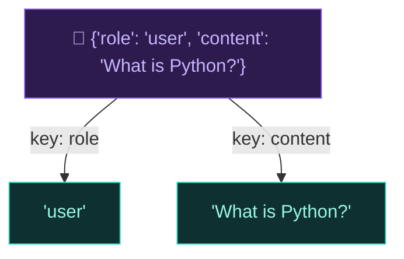

---

## 5. Nested dictionaries and lists

Dictionaries and lists can hold other dictionaries and lists inside them. This is exactly what the `tools` list looks like in the Tools guide:

```python
tools = [
    {
        "type": "function",
        "function": {
            "name": "calculator",
            "description": "Calculate a math expression.",
            "parameters": {
                "type": "object",
                "properties": {
                    "expression": {"type": "string"}
                },
                "required": ["expression"]
            }
        }
    }
]
```

It looks intimidating, but it's just boxes inside boxes. Read it from the outside in:

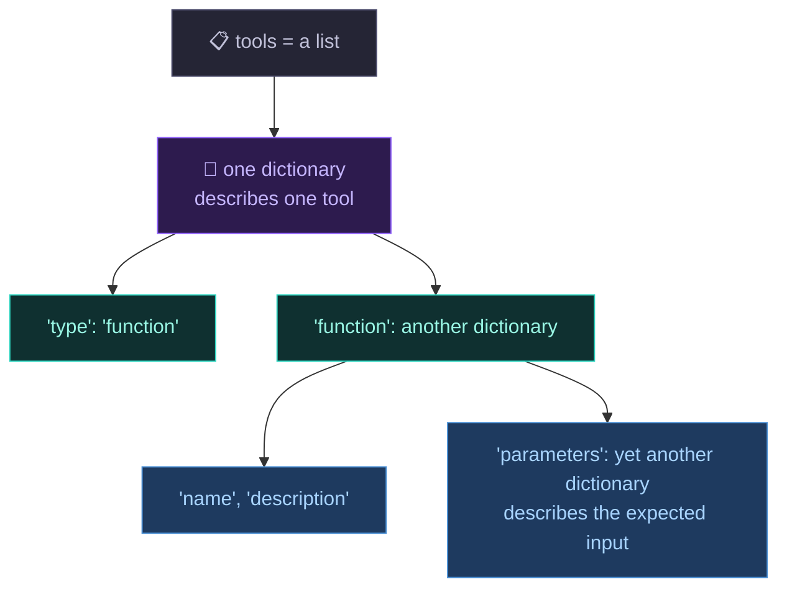

There's no new syntax here, honestly. It's the same `{ }` and `[ ]` you already know, just nested a few levels deep. This whole block only exists so the AI can read it in plain English and understand what each tool needs as input.

---

## 6. Lists

A list is an ordered collection, wrapped in `[ ]`.

```python
chat_history = []
```

You add to it using `.append()`, which always adds to the end:

```python
chat_history.append("hello")
chat_history.append("how are you")
print(chat_history)   # ['hello', 'how are you']
```

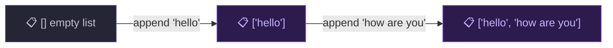

---

## 7. Lists of dictionaries

Combine sections 4 and 6 and you get the single most important pattern in the entire chatbot series.

```python
chat_history = []
chat_history.append({"role": "user", "content": "My name is Samad"})
chat_history.append({"role": "assistant", "content": "Nice to meet you Samad!"})
```

Result:

```python
[
    {"role": "user",      "content": "My name is Samad"},
    {"role": "assistant", "content": "Nice to meet you Samad!"}
]
```

A list of dictionaries. Each dictionary is one message, and the list keeps them all in order. This exact structure is `chat_history`. It's what gets sent to Groq every time, and it's the entire "memory" system. Nothing more complicated is happening behind the scenes.

---

## 8. Dictionaries as lookup tables

Dictionaries don't only store text. Their values can be functions themselves:

```python
def get_weather(city):
    return f"Weather in {city}: 34°C"

def calculator(expression):
    return str(eval(expression))

tool_map = {
    "get_weather": get_weather,
    "calculator": calculator
}
```

Now you can pick which function to run using a plain string name:

```python
tool_name = "calculator"
chosen_function = tool_map[tool_name]
print(chosen_function)   # <function calculator at ...>
```

`tool_map[tool_name]` doesn't run the function, it just fetches it, the same way `message["role"]` fetches a value. To actually run it you still need `()`:

```python
result = tool_map[tool_name]("1847 * 293")
```

```mermaid
flowchart LR
    A["📇 tool_map\n{'calculator': calculator, 'get_weather': get_weather}"]:::purple
    B["🏷️ tool_name = 'calculator'"]:::blue
    A -->|tool_map tool_name| C["⚙️ the actual function\ncalculator"]:::teal
    B --> C
    C -->|add ()| D["🏃 function runs"]:::green

    classDef purple fill:#2d1b4e,stroke:#8b5cf6,color:#c4b5fd
    classDef blue fill:#1e3a5f,stroke:#4a8fd4,color:#a8d4ff
    classDef teal fill:#0f3030,stroke:#2dd4bf,color:#99f6e4
    classDef green fill:#1a3a2a,stroke:#34d399,color:#6ee7b7
```

Why this matters: the AI can only send back plain text like `"calculator"`, it cannot send an actual Python function. `tool_map` is the bridge that turns that text name into a real function your code can call.

---

## 9. Unpacking a dictionary into a function call

Say you have a dictionary of arguments:

```python
tool_args = {"expression": "1847 * 293"}
```

You could call the function by hand:

```python
calculator(expression="1847 * 293")
```

But if you don't know in advance what keys the dictionary has (which is true for the chatbot, since different tools need different arguments), you use `**` to unpack it automatically:

```python
calculator(**tool_args)
```

`**tool_args` means take every key in this dictionary and pass it in as `key=value`. Both lines above do the exact same thing, `**` just does it automatically instead of you typing each argument by hand.

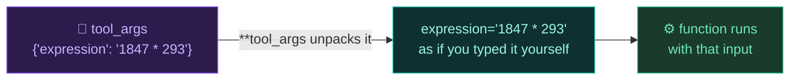

Now the full line from the Tools guide should make sense:

```python
tool_result = tool_map[tool_name](**tool_args)
```

`tool_map[tool_name]` fetches the right function. `(**tool_args)` calls it, unpacking the dictionary of arguments automatically.

---

## 10. if / else

`if / else` lets your code make a decision.

```python
if user_input.lower() == "exit":
    print("Bot: Goodbye!")
else:
    print("Bot: continuing the chat")
```

| Part | Meaning |
|------|--------|
| `if condition:` | run this only if the condition is `True` |
| `else:` | run this if the condition was `False` |
| `==` | checks if two things are equal (`=` assigns a value, that's a different thing) |

In the chatbot, `if / else` decides whether the AI wants a tool or a normal reply:

```python
if response.choices[0].finish_reason == "tool_calls":
    # run a tool
else:
    # just print the reply
```

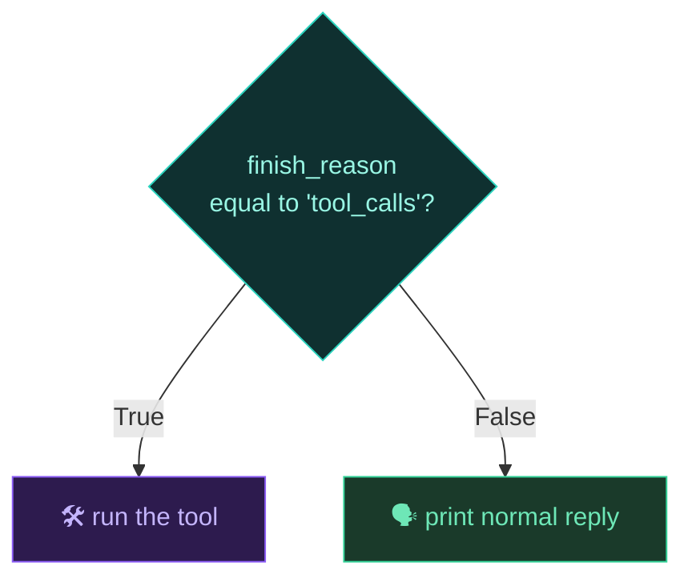

---

## 11. while True loops

`while True` runs forever until `break` stops it.

```python
while True:
    user_input = input("You: ")

    if user_input.lower() == "exit":
        break

    print("You said:", user_input)
```

| Part | Meaning |
|------|--------|
| `while True:` | never becomes False on its own, runs forever unless stopped |
| `input("You: ")` | pauses, waits for you to type, saves it into `user_input` |
| `break` | the only way out, exits the loop immediately |

This exact skeleton is the outer shell of every chatbot version you'll build.

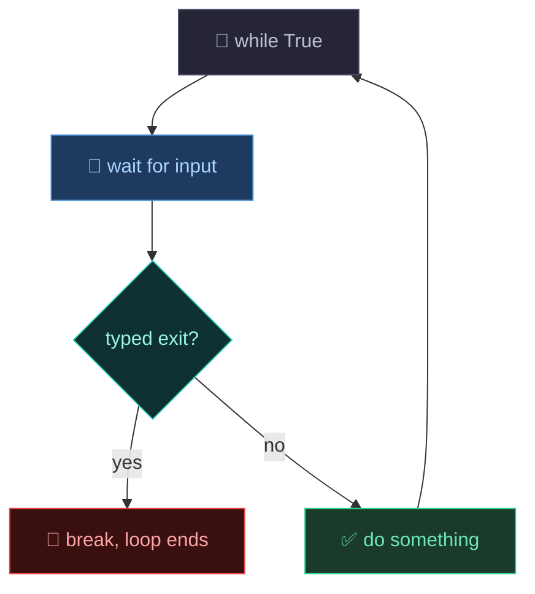

---

## 12. A loop inside a loop

The Agent guide puts one `while True` inside another. Looks new, but it's really just the same idea twice.

```python
while True:                      # outer loop, waits for you to type
    user_input = input("You: ")
    if user_input.lower() == "exit":
        break

    while True:                  # inner loop, keeps acting until AI is done
        # do one step
        if task_is_done:
            break                # only breaks the INNER loop
```

Key thing to remember: `break` only stops the loop it's directly written inside. The `break` inside the inner loop doesn't touch the outer loop at all. The outer loop just moves on to its next line normally, then loops back around to ask for input again.

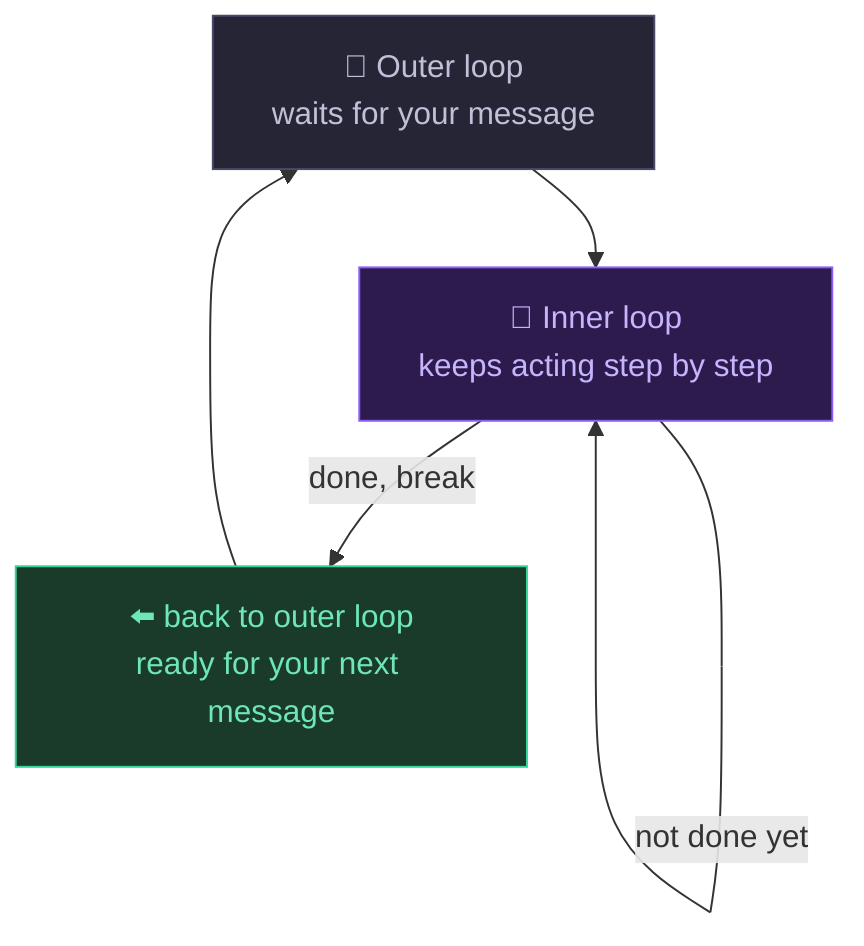

Think of the outer loop as waiting for a new conversation turn, and the inner loop as working through that one turn, possibly in several small steps.

---

## 13. Imports

`import` brings in code someone else already wrote.

```python
import os, json, requests
from dotenv import load_dotenv
from groq import Groq
```

| Line | Meaning |
|------|--------|
| `import os, json, requests` | imports three separate toolkits in one line, same as writing three `import` lines, just shorter |
| `from dotenv import load_dotenv` | brings in just one specific function, not the whole package |

| Toolkit | What it's for in the chatbot |
|---------|-------------------------------|
| `os` | reads your API key from the environment |
| `json` | converts JSON text into Python dictionaries and back |
| `requests` | makes calls to outside APIs, like the weather service |
| `dotenv` | loads your `.env` file so `os.getenv()` can find your key |
| `groq` | the actual client you use to talk to the AI |

Think of `import` as borrowing a toolbox. `import os` borrows the whole box. `from dotenv import load_dotenv` borrows just one tool out of the box, by name.

---

## 14. Chaining function calls

You can call a function, then immediately call another function on whatever it returns, all in one line:

```python
weather = requests.get("https://api.open-meteo.com/...").json()
```

Read it left to right:

| Step | What's happening |
|------|-------------------|
| `requests.get("...")` | makes a web request, returns a response object |
| `.json()` | called immediately on that response, converts it into a Python dictionary |

This is no different from writing two lines:

```python
response = requests.get("https://api.open-meteo.com/...")
weather = response.json()
```

It's just written on one line by chaining the second call directly onto the result of the first.

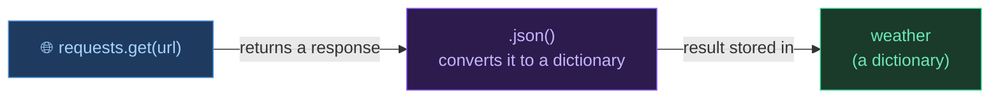

---

## 15. eval(), running text as code

`eval()` takes a string and runs it as if you had typed it directly into Python.

```python
expression = "1847 * 293"
result = eval(expression)
print(result)   # 541171
```

Without `eval()`, `"1847 * 293"` is just plain text, Python has no reason to do math on it. `eval()` is what tells Python to actually run this text as real code.

```mermaid
flowchart LR
    A["📝 '1847 * 293'\njust text"]:::gray -->|eval()| B["🧮 1847 * 293\nreal Python math"]:::purple --> C["541171"]:::green

    classDef gray fill:#252535,stroke:#4a4a6a,color:#c0c0d8
    classDef purple fill:#2d1b4e,stroke:#8b5cf6,color:#c4b5fd
    classDef green fill:#1a3a2a,stroke:#34d399,color:#6ee7b7
```

Good to know: `eval()` will run any code you give it, not just math. That's why it's only used here on a simple calculator input and not on anything coming from an untrusted source.

---

## 16. JSON strings vs Python dictionaries

The AI sends tool arguments back as text that looks like a dictionary, not an actual dictionary:

```python
raw_arguments = '{"expression": "1847 * 293"}'   # this is a STRING, not a dictionary
```

Even though it looks identical to a dictionary, Python treats it as one long piece of text. You can't do `raw_arguments["expression"]` on it, that would fail.

`json.loads()` converts that text into a real, usable dictionary:

```python
import json

tool_args = json.loads(raw_arguments)
print(tool_args["expression"])   # 1847 * 293
```

```mermaid
flowchart LR
    A["📝 '{\"expression\": \"1847 * 293\"}'\ntext that looks like a dictionary"]:::gray -->|json.loads| B["📇 {'expression': '1847 * 293'}\nreal Python dictionary"]:::purple

    classDef gray fill:#252535,stroke:#4a4a6a,color:#c0c0d8
    classDef purple fill:#2d1b4e,stroke:#8b5cf6,color:#c4b5fd
```

Simple rule: if it has quotes around the whole thing, it's a string. `json.loads()` is the step that turns "text shaped like a dictionary" into an actual dictionary you can use `[ ]` on.

---

## 17. Putting all of it together

Here's a tiny script using only what you just learned. No Groq, no real API, nothing new. It fakes what a tool call looks like from the inside. If you understand every line, you're fully ready for all 4 chatbot guides.

```python
import json

def get_weather(city):
    return f"Weather in {city}: 34°C"

def calculator(expression):
    return str(eval(expression))

tool_map = {
    "get_weather": get_weather,
    "calculator": calculator
}

# pretend this text came from the AI
fake_ai_response = '{"expression": "1847 * 293"}'
tool_name = "calculator"

tool_args = json.loads(fake_ai_response)          # text -> dictionary
result = tool_map[tool_name](**tool_args)         # lookup + unpack + call

print(f"[Tool: {tool_name} | Result: {result}]")
```

| What you already know | Where it's used above |
|-----------------------|------------------------|
| Import | `import json` |
| Function | `get_weather`, `calculator` |
| Dictionary as lookup table | `tool_map` |
| JSON string vs dictionary | `fake_ai_response` and `json.loads()` |
| Dictionary unpacking | `**tool_args` |
| f-string | the final `print(f"...")` |

This is basically the exact moment inside the Tools and Agent guides where a tool actually gets executed, just without a real AI sending the request.

---

## Word List

| Word | Simple meaning |
|------|--------------|
| Variable | a labeled box that holds a value |
| f-string | a string with `{variable}` inside it, so Python fills in the value |
| Nested access | going inside data step by step using `.` or `[ ]` |
| Function | a reusable block of code you call by name |
| Type hint | a note like `: str` or `-> str` telling you what type is expected, doesn't change how the code runs |
| `return` | the value a function sends back |
| Dictionary | stores data as key and value pairs |
| List | an ordered collection of items in `[ ]` |
| `.append()` | adds an item to the end of a list |
| List of dictionaries | a list where each item is a dictionary, how chat history is stored |
| Lookup table | a dictionary whose values are functions, used to find the right function by name |
| `**kwargs` unpacking | spreads a dictionary's keys and values into a function call automatically |
| if / else | lets code make a decision based on a condition |
| `==` | checks if two things are equal |
| `while True` | a loop that runs forever until `break` is hit |
| `break` | exits the loop it's written inside, not any outer loop |
| Nested loop | a loop written inside another loop |
| `import` | brings in code someone else already wrote |
| `from X import Y` | brings in just one specific piece from a package |
| Chaining | calling a function directly on the result of another function, in one line |
| `eval()` | runs a text string as if it were real Python code |
| JSON string | text that looks like a dictionary but is actually one long string |
| `json.loads()` | converts a JSON string into a real Python dictionary |

---

## 📘 Official Python Docs

Everything in this guide is a simplified, chatbot-focused explanation. For the full, official reference on Python, every data type, every keyword, every detail, check the official Python documentation:

🔗 [https://docs.python.org/3/tutorial/index.html](https://docs.python.org/3/tutorial/index.html)

---

## What's Next?

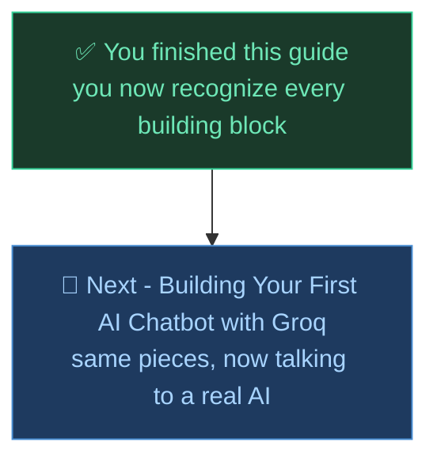

---

*Made by Abdul Samad*
