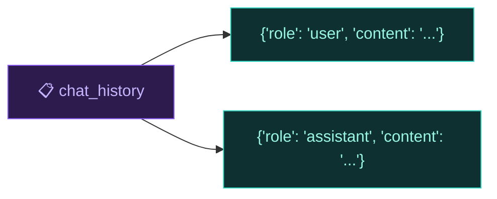
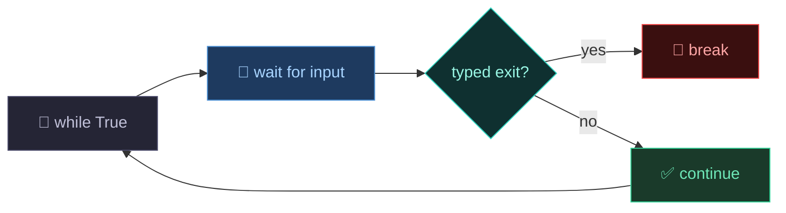
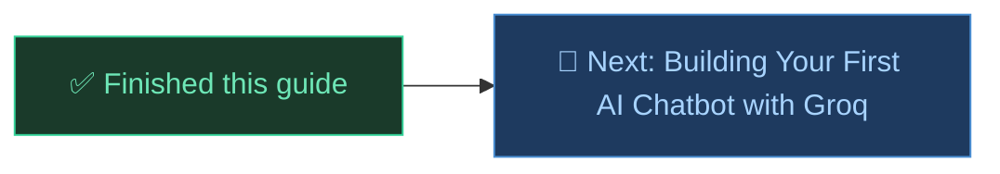

# 🐍 Python Basics You Need Before Building a Chatbot

Before jumping into the chatbot guides, here are the Python concepts you'll actually see in that code, from basic to a bit more advanced. Nothing random, everything here connects directly to something coming up in the Basic Chatbot, Memory, Tools, or Agent guide.

For anything deeper than this, the official Python docs are linked at the end.

---

## Table of Contents

1. [Variables and f-strings](#1-variables-and-f-strings)
2. [Digging into nested data](#2-digging-into-nested-data)
3. [Functions and type hints](#3-functions-and-type-hints)
4. [Dictionaries](#4-dictionaries)
5. [Lists](#5-lists)
6. [Lists of dictionaries](#6-lists-of-dictionaries)
7. [Dictionaries as lookup tables](#7-dictionaries-as-lookup-tables)
8. [Unpacking a dictionary into a function call](#8-unpacking-a-dictionary-into-a-function-call)
9. [if / else](#9-if--else)
10. [while True loops](#10-while-true-loops)
11. [A loop inside a loop](#11-a-loop-inside-a-loop)
12. [Imports](#12-imports)
13. [Chaining function calls](#13-chaining-function-calls)
14. [eval() and json.loads()](#14-eval-and-jsonloads)
15. [Putting it together](#15-putting-it-together)
16. [Word List](#word-list)
17. [Official Python Docs](#official-python-docs)
18. [What's Next?](#whats-next)

---

## 1. Variables and f-strings

A variable is a labeled box that holds something.

```python
user_input = "What is Python?"
```

f-strings let you drop a variable's value directly into text, instead of stitching strings together with `+`.

```python
city = "Islamabad"
print(f"Weather in {city}: 34°C")
# Output: Weather in Islamabad: 34°C
```

Anything inside `{ }` in an f-string is real Python, not plain text.

---

## 2. Digging into nested data

A lot of chatbot code is just "go inside this, then go inside that." You'll see chains like this a lot:

```python
response.choices[0].message.content
```

| Step | What you're doing |
|------|-------------------|
| `response` | the full object you got back |
| `.choices` | go inside it, grab the list called `choices` |
| `[0]` | take the first item in that list |
| `.message` | go inside that item, grab `message` |
| `.content` | go inside that, grab the actual text |

Same idea with dictionaries, just using `[ ]` instead of `.`, like `weather['current_weather']['temperature']`. A long chain is just several of these steps back to back, nothing more advanced happening there.

---

## 3. Functions and type hints

A function is a reusable block of code you run by calling its name.

```python
def calculator(expression: str) -> str:
    return str(eval(expression))

answer = calculator("1847 * 293")
print(answer)   # 541171
```

`def` starts a new function. `calculator` is the name you call it by. `expression: str` is the input, and `: str` is a type hint saying "this should be text." `-> str` says "this function returns text." Type hints are just notes for humans reading the code, Python doesn't enforce them.

This matters a lot later because tools in the chatbot are just functions like this one.

---

## 4. Dictionaries

A dictionary stores key and value pairs, wrapped in `{ }`.

```python
message = {"role": "user", "content": "What is Python?"}

print(message["role"])      # user
print(message["content"])   # What is Python?
```

You grab a value by its key, not by position. This exact shape is how every chatbot message gets stored.

---

## 5. Lists

A list is an ordered collection, wrapped in `[ ]`.

```python
chat_history = []
chat_history.append("hello")
chat_history.append("how are you")

print(chat_history)   # ['hello', 'how are you']
```

`.append()` always adds a new item to the end of the list.

---

## 6. Lists of dictionaries

Combine sections 4 and 5 and you get the most important pattern in the whole chatbot series.

```python
chat_history = []
chat_history.append({"role": "user", "content": "My name is Samad"})
chat_history.append({"role": "assistant", "content": "Nice to meet you Samad!"})
```

```python
[
    {"role": "user",      "content": "My name is Samad"},
    {"role": "assistant", "content": "Nice to meet you Samad!"}
]
```

Each dictionary is one message. The list keeps them all in order. This exact structure is `chat_history`, it's the entire "memory" system in the chatbot. Nothing more complicated than that.



---

## 7. Dictionaries as lookup tables

Dictionaries don't only store text, their values can be functions too:

```python
def get_weather(city):
    return f"Weather in {city}: 34°C"

def calculator(expression):
    return str(eval(expression))

tool_map = {
    "get_weather": get_weather,
    "calculator": calculator
}
```

Now you can pick which function to run using a plain string name:

```python
tool_name = "calculator"
result = tool_map[tool_name]("1847 * 293")
```

`tool_map[tool_name]` fetches the function, the same way `message["role"]` fetches a value. You still need `()` to actually run it.

Why this matters: the AI can only send back plain text like `"calculator"`, it cannot send an actual Python function. `tool_map` is the bridge that turns that text name into a real function your code can call.

---

## 8. Unpacking a dictionary into a function call

Say you have a dictionary of arguments:

```python
tool_args = {"expression": "1847 * 293"}
```

You could call the function by hand, `calculator(expression="1847 * 293")`. But since different tools need different arguments, you use `**` to unpack the dictionary automatically instead:

```python
calculator(**tool_args)
```

`**tool_args` means "take every key in this dictionary and pass it in as `key=value`." Now this line from the Tools guide should make sense:

```python
tool_result = tool_map[tool_name](**tool_args)
```

`tool_map[tool_name]` fetches the right function, `(**tool_args)` calls it with the arguments unpacked automatically.

---

## 9. if / else

`if / else` lets your code make a decision.

```python
if response.choices[0].finish_reason == "tool_calls":
    # run a tool
else:
    # just print the reply
```

`if condition:` runs only if the condition is True. `else:` runs if it wasn't. `==` checks if two things are equal (`=` assigns a value, that's different).

---

## 10. while True loops

`while True` runs forever until `break` stops it.

```python
while True:
    user_input = input("You: ")

    if user_input.lower() == "exit":
        break

    print("You said:", user_input)
```

This exact skeleton is the outer shell of every chatbot version you'll build.



---

## 11. A loop inside a loop

The Agent guide puts one `while True` inside another. It looks new but it's the same idea twice.

```python
while True:                      # outer loop, waits for you to type
    user_input = input("You: ")
    if user_input.lower() == "exit":
        break

    while True:                  # inner loop, keeps acting until AI is done
        if task_is_done:
            break                # only breaks the INNER loop
```

`break` only stops the loop it's directly written inside. The inner `break` doesn't touch the outer loop, the outer loop just moves on and eventually loops back for your next message.

---

## 12. Imports

`import` brings in code someone else already wrote.

```python
import os, json, requests
from dotenv import load_dotenv
from groq import Groq
```

`import os, json, requests` imports three toolkits in one line, same as writing three separate `import` lines. `from dotenv import load_dotenv` brings in just one specific function, not the whole package.

| Toolkit | What it's for in the chatbot |
|---------|-------------------------------|
| `os` | reads your API key from the environment |
| `json` | converts JSON text into Python dictionaries and back |
| `requests` | makes calls to outside APIs, like the weather service |
| `dotenv` | loads your `.env` file so `os.getenv()` can find your key |
| `groq` | the client you use to talk to the AI |

---

## 13. Chaining function calls

You can call a function, then immediately call another function on whatever it returns, all in one line:

```python
weather = requests.get("https://api.open-meteo.com/...").json()
```

`requests.get("...")` makes a web request and returns a response. `.json()` is called immediately on that response and converts it into a Python dictionary. It's the same as writing two separate lines, just chained together.

---

## 14. eval() and json.loads()

`eval()` takes a string and runs it as if you had typed it directly into Python.

```python
expression = "1847 * 293"
result = eval(expression)
print(result)   # 541171
```

Without `eval()`, `"1847 * 293"` is just plain text. `eval()` is what tells Python to actually run it as code. It will run any code you give it, not just math, so it's only used here on simple calculator input.

The AI also sends tool arguments back as text that looks like a dictionary, but isn't one yet:

```python
raw_arguments = '{"expression": "1847 * 293"}'   # this is a STRING
```

`json.loads()` converts that text into a real, usable dictionary:

```python
import json
tool_args = json.loads(raw_arguments)
print(tool_args["expression"])   # 1847 * 293
```

Simple rule: if it has quotes around the whole thing, it's a string. `json.loads()` turns "text shaped like a dictionary" into an actual dictionary you can use `[ ]` on.

---

## 15. Putting it together

A small script using most of what you just learned. No Groq, no real API, nothing new.

```python
import json

def get_weather(city):
    return f"Weather in {city}: 34°C"

def calculator(expression):
    return str(eval(expression))

tool_map = {"get_weather": get_weather, "calculator": calculator}

fake_ai_response = '{"expression": "1847 * 293"}'
tool_name = "calculator"

tool_args = json.loads(fake_ai_response)
result = tool_map[tool_name](**tool_args)

print(f"[Tool: {tool_name} | Result: {result}]")
```

| Concept | Where it's used above |
|---------|------------------------|
| Import | `import json` |
| Function | `get_weather`, `calculator` |
| Dictionary as lookup table | `tool_map` |
| JSON string vs dictionary | `fake_ai_response`, `json.loads()` |
| Dictionary unpacking | `**tool_args` |
| f-string | the final `print(f"...")` |

This is basically the exact moment inside the Tools and Agent guides where a tool actually gets executed, just without a real AI sending the request.

---

## Word List

| Word | Simple meaning |
|------|--------------|
| Variable | a labeled box that holds a value |
| f-string | a string with `{variable}` inside it |
| Nested access | going inside data step by step using `.` or `[ ]` |
| Function | a reusable block of code you call by name |
| Type hint | a note like `: str` telling you what type is expected, doesn't change how the code runs |
| Dictionary | stores data as key and value pairs |
| List | an ordered collection of items |
| `.append()` | adds an item to the end of a list |
| List of dictionaries | how chat history is stored |
| Lookup table | a dictionary whose values are functions |
| `**kwargs` unpacking | spreads a dictionary's keys and values into a function call automatically |
| if / else | a decision in your code |
| `while True` | a loop that runs forever until `break` |
| `break` | exits the loop it's written inside, not any outer loop |
| Nested loop | a loop written inside another loop |
| `import` | brings in code someone else wrote |
| Chaining | calling a function on the result of another function, in one line |
| `eval()` | runs a text string as real Python code |
| `json.loads()` | converts a JSON string into a real Python dictionary |

---

## Official Python Docs

This guide only covers what you need for the chatbot series. For the full official reference on Python, check the docs:

🔗 [https://docs.python.org/3/tutorial/index.html](https://docs.python.org/3/tutorial/index.html)

---

## What's Next?



---

*Made by Abdul Samad*
